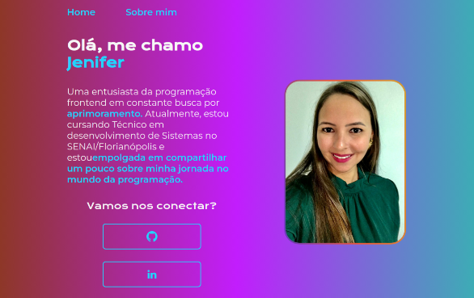

## 📅Programa Desenvolve/DevWeb - Grupo Boticário - Edição 2024. 
 Realizado o portifólio atráves das aulas do curso de HTML e CSS básico da escola Alura.

## 👩‍💻 Tecnologias
- HTML
- CSS

### 💻 [Link protótipo Figma](https://www.figma.com/file/nGj94SGL53ZlNK1wjIv09E/Portfolio---Curso?type=design&node-id=0%3A1&mode=design&t=cwQak8sewjdshaso-1)

### 🚀 [Link projeto publicado](https://portifolio-jenifer-desenvolve.vercel.app/)

### 