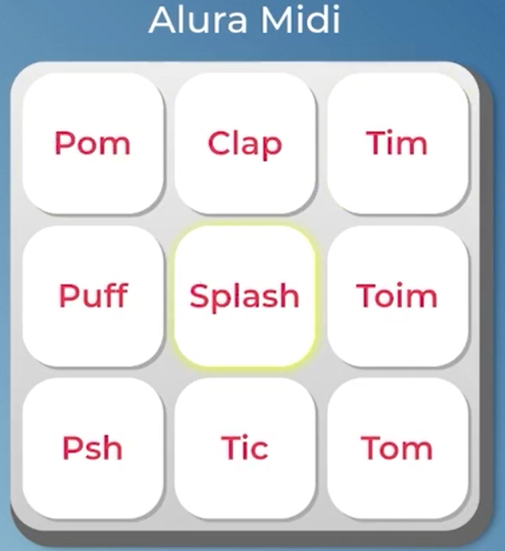

## 📅Programa Desenvolve/DevWeb - Grupo Boticário - Edição 2024. 
 O Alura Midi é um instrumento musical de interface digital, onde cada botão reproduz o som de um instrumento.

## 👩‍💻 Tecnologias
- JavaScript
- HTML
- CSS

### 🚀 [Link projeto publicado](https://alura-midi-desenvolve.vercel.app/)

### 